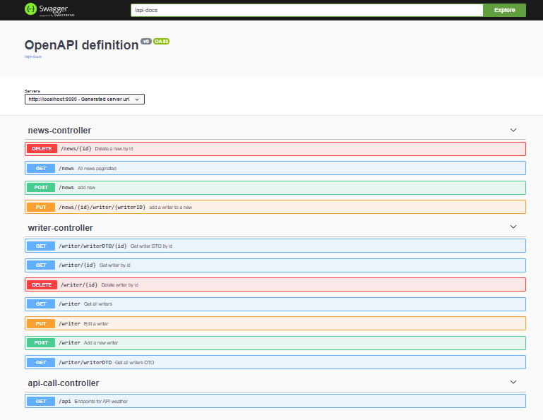
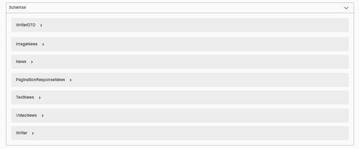
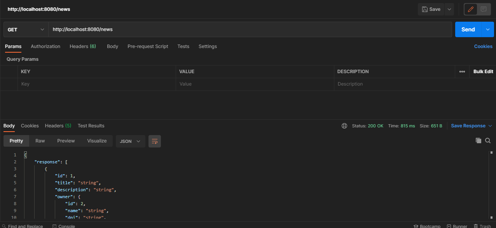
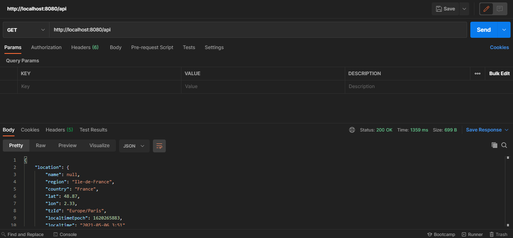
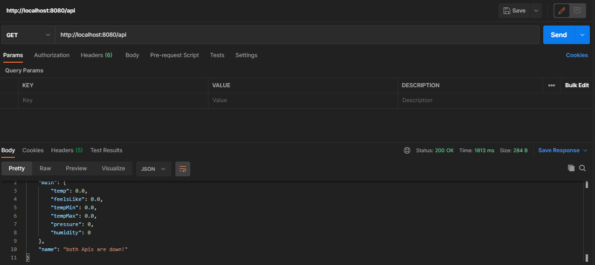
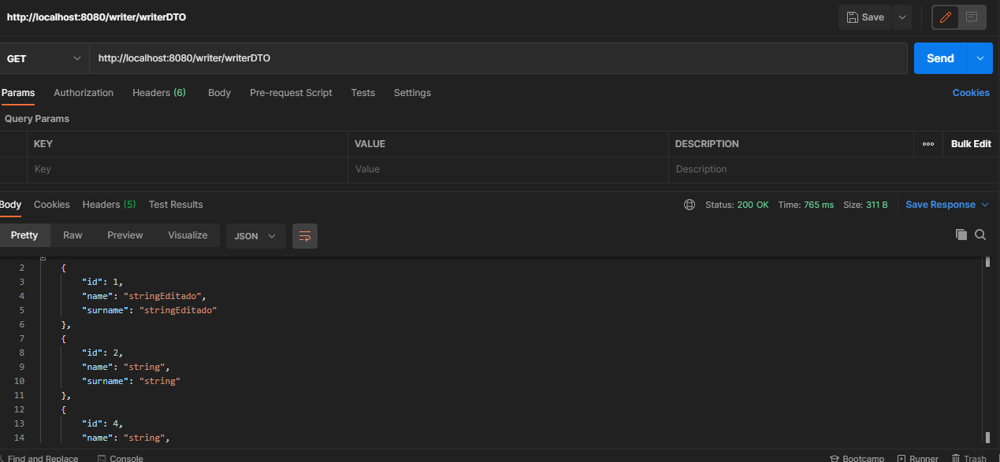

# HenryNews
> Backend using Spring for Bootcamp

## Functionalities <g-emoji class="g-emoji" alias="gear" fallback-src="https://github.githubassets.com/images/icons/emoji/unicode/2699.png">⚙️</g-emoji>

- CRUD.
- Call a weather api, called with fallback and call a second api
- Has DTO for class Writer that doesn't show any fields.
- pagination

## Endpoints <g-emoji class="g-emoji" alias="pushpin" fallback-src="https://github.githubassets.com/images/icons/emoji/unicode/1f4cc.png">📌</g-emoji>
> Swagger url: `http://localhost:8080/swagger.html`

### /news

### /api

### /api (Two API's fail)

### /writer/writerDTO

## Technologies <g-emoji class="g-emoji" alias="toolbox" fallback-src="https://github.githubassets.com/images/icons/emoji/unicode/1f9f0.png">🧰</g-emoji>

### BackEnd:

- Spring:
    - Dependencies:
        - Spring web
        - Data JPA
        - H2 Database
        - Lombok
        - MySQL connector
        - Swagger (springdoc: openapi-ui and openapi-webmvc-core)
        - GSON
        - Circuit Breaker (resilience4j)
        - DTO (modelmapper)
    
- Docker-compose.yml (rise MySQL)
- Database:
    - MySQL
    
- Endpoint:
    - Swagger
    - Postman

# Instructions <g-emoji class="g-emoji" alias="clipboard" fallback-src="https://github.githubassets.com/images/icons/emoji/unicode/1f4cb.png">📋</g-emoji>
- Clone or download repo
- Start virtual mysql with command : docker-compose up
- Run BaseApplication
- Ready to test endpoints! =)

